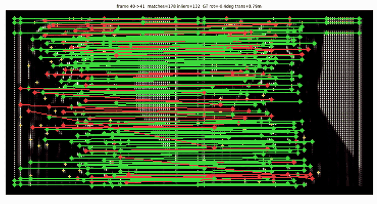
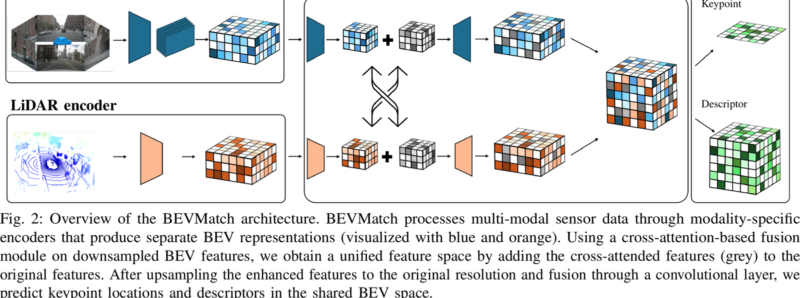
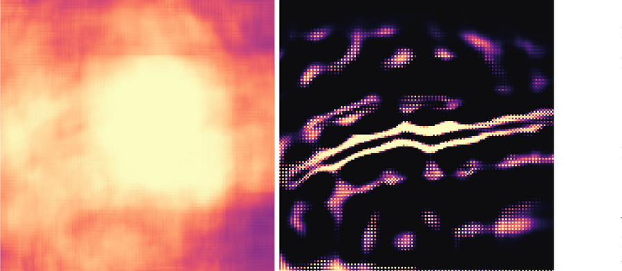
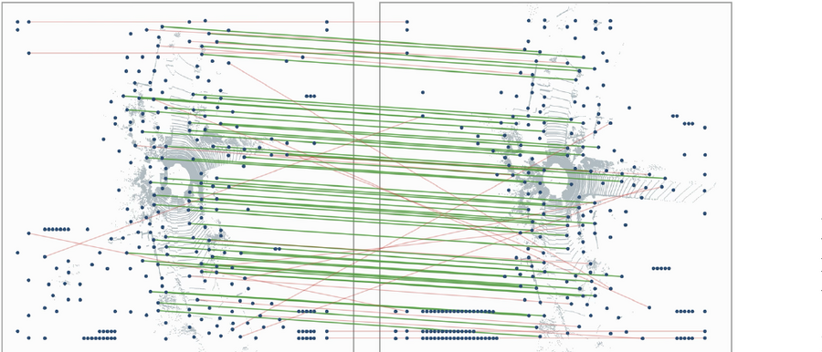

<div align="center">

# BEVMatch

### Uni-, Cross-, and Multi-Modal Keypoint Matching for Bird's-Eye-View Perception

[](#citation)
[](#pretrained-weights)
[](LICENSE)



*Keypoints detected and matched directly in a metric BEV latent space. Green: RANSAC inliers, red: rejected.*

</div>

---

## What this is

BEVMatch detects and describes keypoints **inside a shared BEV latent space** rather than in the
image plane or on raw point clouds. Because camera and LiDAR features are lifted into the same
metric grid, one set of weights matches

- camera ↔ camera (**C2C**), LiDAR ↔ LiDAR (**L2L**), multi-modal ↔ multi-modal (**M2M**), and
- **camera ↔ LiDAR** (**C2L**) — one modality against the other, which image-plane matchers cannot do.

The result is a metric SE(2) transform without any scale recovery: the BEV grid is metric by
construction. Training uses relative ego-pose estimates between two frames as geometric
supervision — no human-annotated keypoint labels.

<div align="center">

</div>

## Results at a glance

Refining the detector turns semi-dense score maps into isolated landmarks that keep sub-cell
accuracy — the basis for keyframe odometry:

<div align="center">

</div>

*Detection scores of the base detector (left) and after refinement (right) on the same frame, from
identical frozen encoder features.*

<div align="center">

</div>

*Detected landmarks (dark blue) and mutual nearest-neighbor matches between two consecutive KITTI
keyframes; green are RANSAC inliers, red are rejected.*

On KITTI sequence 09, keyframe odometry over these landmarks reaches **1.33 % RTE / 0.39° per 100 m at
2.44 m ATE**, in the range of reported monocular BEV odometry results. The paper additionally evaluates matching on nuScenes, Waymo and an in-house dataset.

## Released settings

| setting | config | description |
|---------|--------|-------------|
| **nuScenes** | `configs/bevmatch_nuscenes.py` | main model: cross-attention fusion, auxiliary HD-map segmentation head, all matching modes (C2C, C2L, L2L, M2M) |
| **KITTI** | `configs/bevmatch_kitti_odometry.py` | keyframe odometry: concatenation fusion, no auxiliary head (KITTI has neither surround-view cameras nor an HD map) |

## Pretrained weights

| model | dataset | config | download |
|-------|---------|--------|----------|
| BEVMatch (cross-attention + aux head) | nuScenes | `configs/bevmatch_nuscenes.py` | _link to be added_ |
| BEVMatch (concatenation fusion, refined detector) | KITTI odometry | `configs/bevmatch_kitti_odometry.py` | _link to be added_ |

The published checkpoints are inference-only (about 150 MB each); the optimizer state of the
training checkpoints is stripped:

```shell
python -c "import torch,sys; c=torch.load(sys.argv[1],map_location='cpu'); \
  torch.save({'meta':c['meta'],'state_dict':c['state_dict']}, sys.argv[2])" epoch_10.pth bevmatch_nuscenes.pth
```

## Layout

```
bevmatch/    model, dataset adapters, data preprocessor   (needs MMDetection3D)
configs/     self-contained configs (matching, KITTI odometry, refined detector)
tools/       KITTI odometry, metrics, external baselines, and analysis scripts
assets/      figures and the match animation
```

## Setup

Install MMDetection3D (v1.4, with the MMEngine/MMCV versions it requires), then make `bevmatch`
importable. The configs refer to components by name; importing the package registers them.

```shell
pip install -r requirements.txt      # in addition to the MMDetection3D stack
export PYTHONPATH=$(pwd):$PYTHONPATH
```

Dependencies needed only by individual tools (plots, external baselines) are listed, commented
out, at the end of `requirements.txt`.

`bevmatch` is self-contained and patches nothing inside MMDetection3D — use a clean install.
Two CUDA extensions (voxelization and BEV pooling) are built once:

```shell
cd bevmatch/ops && python setup.py build_ext --inplace && cd -
```

They are needed for model inference only; the odometry and metric tools run without them.
On a machine where no GPU is visible (a login node, for instance), PyTorch cannot infer the target
architecture and the build aborts with `IndexError` in `_get_cuda_arch_flags`. Name the architecture
explicitly in that case, e.g. `TORCH_CUDA_ARCH_LIST=8.0` for A100 or `8.6` for RTX 30xx.

## Data

```
data/nuscenes/                                     # standard MMDetection3D nuScenes layout
data/kitti_odom/kitti_odom_infos_{train,val}.pkl
data/kitti_odometry/dataset/sequences/{00..10}/    # velodyne, image_2, calib.txt, poses.txt
```

`tools/kitti_rte_rre.py` reads ground-truth poses from `$KITTI_SEQ_ROOT`
(default `data/kitti_odometry/dataset/sequences`) and reports against both the official KITTI poses
and the SuMa poses when present.

## Training

```shell
python tools/train.py configs/bevmatch_nuscenes.py          # MMDetection3D entry point
python tools/train.py configs/bevmatch_kitti_odometry.py
```

KITTI is trained on sequences 00–08 and 10 and evaluated on the held-out sequence 09.

## KITTI odometry evaluation

Inference and evaluation are separate: once keypoints are cached, everything else runs on CPU
without MMDetection3D.

```shell
# 1) cache keypoints + descriptors for a sequence (GPU)
KPT_ODOM_CFG=configs/bevmatch_kitti_odometry.py CKPT=<checkpoint>.pth \
  OUTDIR=work_dirs/odom_seq09 python tools/kitti_cache_descriptors.py

# 2) add sub-cell refined coordinates; rewrites cells, descriptors and coordinates together,
#    because GPU inference is not bit-deterministic (see note below)
KPT_ODOM_CFG=configs/bevmatch_kitti_odometry.py CKPT=<checkpoint>.pth \
  CACHE=work_dirs/odom_seq09 SUBCELL=1 python tools/kitti_cache_subcell.py

# 3) keyframe odometry: match consecutive keyframes, estimate SE(2), accumulate
KPT_ODOM_CFG=configs/bevmatch_kitti_odometry.py CKPT=<checkpoint>.pth SUBCELL=1 \
  FRAME_STRIDE=8 OUTDIR=work_dirs/odom_seq09 python tools/kitti_kpt_odometry.py

# 4) metrics (CPU, no MMDetection3D needed)
python tools/kitti_rte_rre.py work_dirs/odom_seq09 09 8
```

`tools/count_eval_pairs.py` reproduces the number of evaluated frame pairs per motion bin directly
from the dataset infos.

## External baselines

The image and LiDAR baselines of Tables I and II run on CPU and need neither the model nor
MMDetection3D -- they read the same info pickle and the same motion bins as our own evaluation, so
the numbers are directly comparable:

```shell
# SIFT / ORB / SuperPoint / LoFTR / DeDoDe / RoMa on the front camera
python tools/baseline_matchers.py --infos <infos.pkl> --data-root <data> \
  --methods sift+orb+superpoint --bins close,far

# GICP / FGR-FPFH / RANSAC-FPFH on the point clouds
python tools/baseline_lidar.py --infos <infos.pkl> --data-root <data> --methods gicp,ransac
```

Both write per-pair CSV/JSON, from which RTE/RRE and recall follow with the protocol of Sec. V-A.

## Dynamic objects and detector refinement

`tools/dynamic_object_analysis.py` reproduces the dynamic-object study (Sec. V-F.4): it labels a
keypoint as dynamic when it falls inside the BEV footprint of a ground-truth box moving faster than
`V_DYN` m/s and reports the share among detections, tentative matches and RANSAC inliers.

`configs/bevmatch_refined_detector.py` trains the optional refined (sparse) detector of Sec. V-G on a
frozen encoder -- only the score head is updated. For the equal-budget comparison, the keypoint head
honours a `KPT_EVAL_CAP` environment variable that caps extraction to the top-K peaks after NMS.

## Pose regression instead of matching

Table III of the paper isolates the pose-estimation backend: on the **frozen** encoder, the keypoint
and descriptor heads together with the RANSAC solver are replaced by a correlation-based SE(2)
regression head. `bevmatch/pose_regression.py` holds the variants; the strongest one (`corrcnn`,
27.6 M parameters) embeds both BEV maps to 32 channels with two convolutions, builds a 41x41 cost
volume from the normalized correlation of every integer shift within +-24 m, and reads translation
and rotation -- the latter as a `(cos, sin)` pair -- from it with two convolutions and a two-layer
MLP. Training minimizes a smooth-L1 loss on both terms.

All variants are trained in one job on the same frozen features, so they see identical batches in
identical order and the comparison measures the architecture rather than the data order:

```shell
# encoder frozen throughout; MODALITY_DROPOUT=1 reproduces the row reported in the paper
CFG=configs/bevmatch_nuscenes.py CKPT=<bevmatch.pth> \
  ARCHS=corr,corrcnn,hires,deep MODALITY_DROPOUT=1 OUT_DIR=work_dirs/posereg \
  python tools/pose_regression_train.py

# evaluation, once per modality combination (M2M, L2L, C2C, C2L)
CFG=configs/bevmatch_nuscenes.py CKPT=<bevmatch.pth> HEAD_DIR=work_dirs/posereg \
  MODE=C2L OUT=posereg_C2L.txt python tools/pose_regression_eval.py
```

The evaluation follows the protocol of Table I exactly -- same bins, same success criterion, same
recall thresholds -- so the numbers are directly comparable to the matching rows. It additionally
reports two trivial references, a zero predictor and the best constant predictor of each bin: a head
that does not beat them has learned nothing, which is how an earlier collapsed variant was caught.

## Notes on the evaluation

**ATE alignment.** Trajectory error is reported after *rigid* alignment, without fitting a scale
factor: the BEV grid is metric, so no scale recovery is warranted — fitted scale factors deviate by
less than 0.6 % from unity. `umeyama_ate(..., with_scale=True)` gives the Sim(2) variant for
comparison.

**Non-determinism.** GPU inference is not bit-deterministic; about 2 % of the selected keypoints
differ between runs. Step 2 above therefore rewrites the whole cache rather than adding to it, and
reported numbers are averaged over three runs (per-run spread: RTE ±0.1 %, ATE ±0.1 m).

## Citation

```bibtex
@article{bevmatch,
  title   = {{BEVMatch}: Uni-, Cross-, and Multi-Modal Keypoint Matching for Bird's-Eye-View Perception},
  author  = {Beer, Lukas and Backhaus, Anton and Luettel, Thorsten and Maehlisch, Mirko},
  journal = {IEEE Robotics and Automation Letters},
  year    = {2026}
}
```

## License

Apache License 2.0 — see [LICENSE](LICENSE). This work builds on
[MMDetection3D](https://github.com/open-mmlab/mmdetection3d) and
[BEVFusion](https://github.com/mit-han-lab/bevfusion), both Apache 2.0; see [NOTICE](NOTICE)
for the attribution of derived files.
